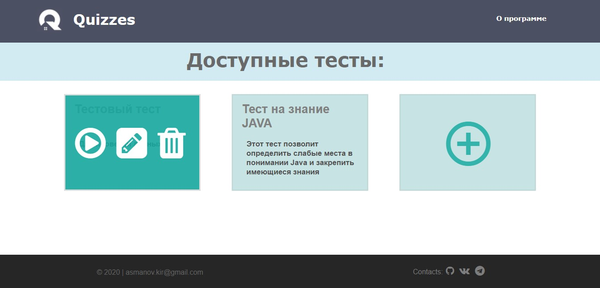
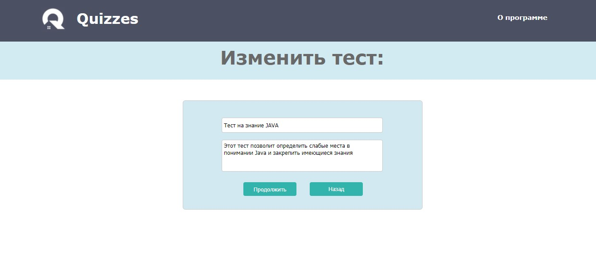
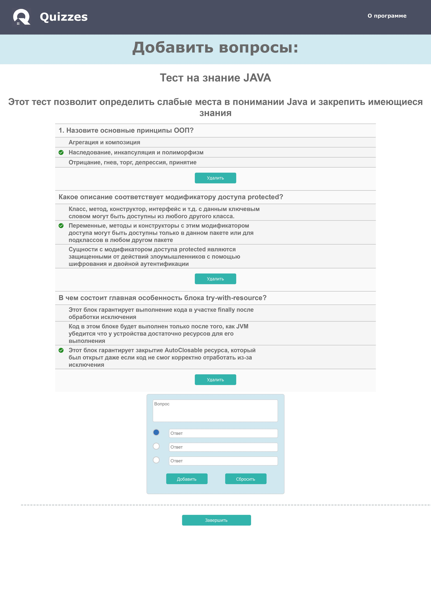
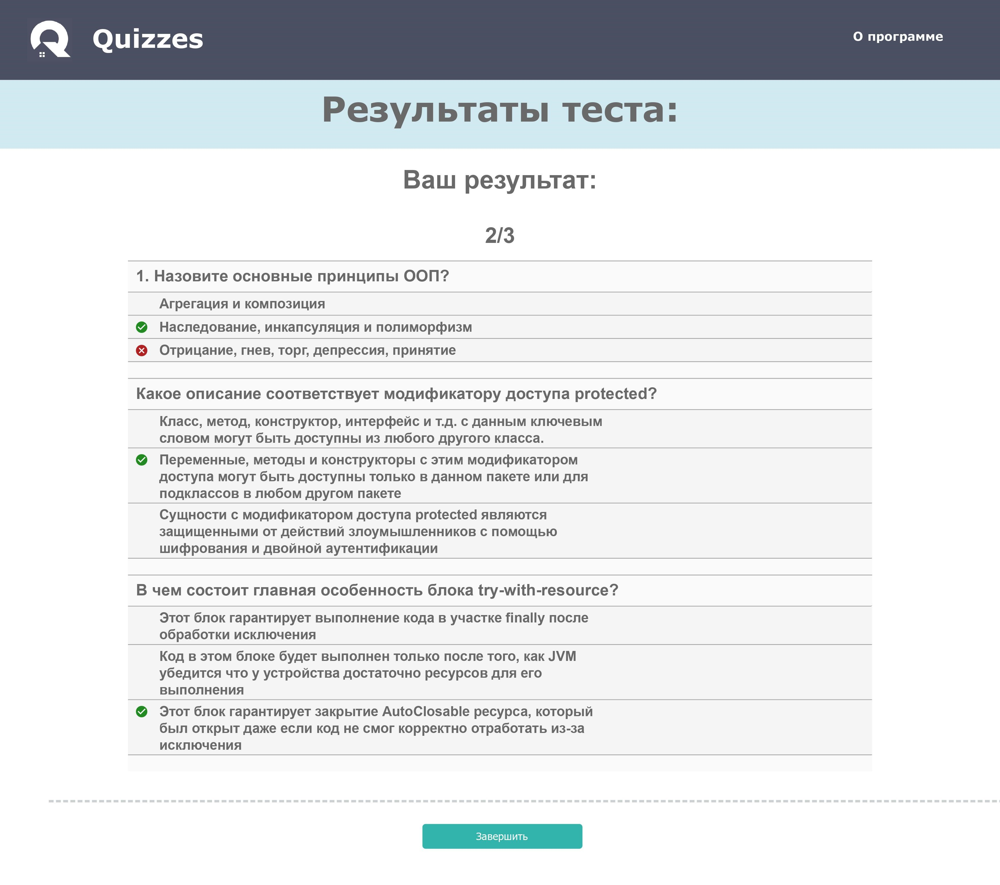

## **Quizzes**

**Quizzes - это сервис для создания, прохождения и редактирования тестов и опросов. 
Этот проект был написан в целях изучения и закрепления технологии Spring Framework**

~~~~
Стек технологий:

 - Spring Boot, MVC
 - Spring Data (JPA)
 - PostgreSQL
 - Html, css, js + Thymeleaf
~~~~
##### **Возможности сервиса:**
 - Отображение всех доступных тестов;
 - Создание нового теста либо изменение уже существующего;
 - Удаление теста;
 - Редактирование списка вопросов (добавление/удаление) для каждого из тестов;
 - Возможность прохождения тестов;
 - Подробная информация о результатах; 
 
 
 ##### **Функционал в будущих обновлениях:**
  - Авторизация и регистрация пользователей с правами доступа;
  - Поиск тестов по названию и/или описанию;
  - Возможность добавления различных опций для ответа (например, выбор нескольких ответов);
  - Возможность ограничения времени на прохождение теста;
 
 
## **Скриншоты:**
 
 Список доступных тестов:
 

 Форма изменения теста:
 

Редактирование вопросов:
 

Результаты прохождения теста:
 
